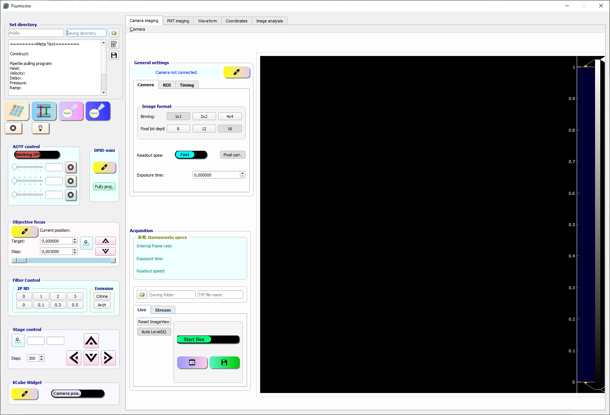

# Project Name
A comprehensive and intelligent software for voltage imaging. Developed in the Brinks lab.

## Table of Contents
* [General Info](#general-information)
* [Features](#features)
* [Widgets](#widgets)
* [Supported hardware](#supported hardware)
* [Screenshots](#screenshots)
* [Setup](#setup)
* [Usage](#usage)
* [Project Status](#project-status)
* [To do](#to do)
* [Acknowledgements](#acknowledgements)
* [Contact](#contact)
<!-- * [License](#license) -->

## General Information
- Provide general information about your project here.
- What problem does it (intend to) solve?
- What is the purpose of your project?
- Why did you undertake it?

## Features
Voltage imaging experiments typically involve coordination between different sets of devices for different types of experiments. Taking that into account, the primary design principle is modular programming, in which each piece of hardware control or a function unit is a module. The corresponding control modules can easily be assembled when recruiting a different set of functional units. The communication between modules can be channelled through the main panel so that the information generated from the individual pieces can be shared with the whole assembly. This is a crucial feature of this intelligent microscope. The analysis module can pass the results to all parts of the software through this inter-module communication and then guide the decision-making for the next experiment.

Here the incarnation of the module is a widget. A widget for each function unit is composed of a front-end graphic interface and a back-end actuator. Commanding the hardware can be done via human interaction through the widget user interface or by calling the functions in the application programming interface (API) from the backend. A widget can call functions from its backend or backends from other widgets. Each widget can stand alone and run itself. For applications that involve a selection of widgets, the main panel can be created as a deck to contain the useful widgets and pass information between them.

## Widgets
List the ready features here:
- PatchClamp.ui_patchclamp_sealtest: The GUI for patch clamp.
- NIDAQ.WaveformWidget: The GUI for configuring and executing waveforms in National Instrument Data Acquisition (DAQ) device.
- GalvoWidget.PMTWidget: For PMT scanning imaging.
- ImageAnalysis.AnalysisWidget: Data Analysis widget.
- SampleStageControl.StageMoveWidget: The GUI for sample stage movement control.
- NIDAQ.AOTFWidget: To control AOTF, which is controlled by NI-daq.
- ThorlabsFilterSlider.FilterSliderWidget: Controller for Thorlabs filter slider.
- PI_ObjectiveMotor.ObjMotorWidget: Widget for objective motor control.
- CoordinatesManager.CoordinatesWidget: Widget to create mask based on widefield image. Project mask with DMD or galvos
- Autopatcher: To perform automated patch clamp.

## Supported hardware

## Screenshots

## Setup
To set up the environment, 

## Usage
How does one go about using it?
Provide various use cases and code examples here.

`write-your-code-here`

## Project Status
Project is: _in progress_, and we are preparing to release the first version soon.

## To do
To do:
- Feature to be added 1
- Feature to be added 2

One key feature to be added is the network analysis ability in typical all-optical neuronal network interrogation experiments. The data acquisition and first-stage image analysis can be done in the current version, to turn the variance at each cell data into a network model with nodes and the ability to simulate or even predict is the goal of the next iteration. The advancing machine learning field will provide an algorithm suitable for reconstruct the network and the acquired data can be fed as training data in real-time. It will be ideal to generate a probability map on neurons and guide the next round of interrogation, and through this iterative process we will gradually learn the role of certain populations in behavioural tasks. Hopefully these analytical tools will provide decent statics to guide the sampling space and decrease the amount of time or photons needed during the experiment.

Another potential feature is to adapt the illumination according to the sample and minimize the photobleaching and heating. By analysing the dynamics of live video, the algorithm will be able to determine cell of interest and shape the illumination accordingly to minimize the amount of photons pumped into the sample. This would happen in an automated fashion, much faster than human decision and operation. 

## Acknowledgements
Give credit here.
- This project was inspired by...
- This project was based on [this tutorial](https://www.example.com).
- Many thanks to...

## Contact
X.Meng-4@tudelft.nl

<!-- Optional -->
<!-- ## License -->
<!-- This project is open source and available under the [... License](). -->
